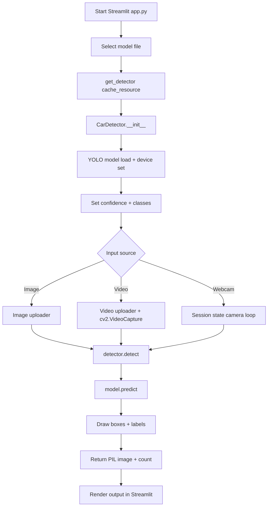

# OmniDetect AI

## 1) Project Overview

OmniDetect AI is a Streamlit application for object detection using Ultralytics YOLO models.

Implemented capabilities (from code):
- Select one of three local model files: `yolo26n.pt`, `yolo26m.pt`, `yolo26l.pt`.
- Configure confidence threshold (`0.0` to `1.0`).
- Optionally filter detections by selected class names.
- Run detection on:
  - Uploaded images
  - Uploaded videos (processes every 3rd frame)
  - Live webcam frames
- Display annotated output and detected object count.

Scope note:
- This repository does **not** include a `backend.py` file.

## 2) Architecture Overview

### Components

| Component | File | Responsibility |
|---|---|---|
| UI Layer | `app.py` | Streamlit layout, controls, file/camera input, rendering results |
| Inference Layer | `detector.py` | Model loading, device selection, prediction, annotation drawing |
| Tests | `tests/*.py` | Unit/integration/ML validation/edge/stress behavior checks |

### Backend / Agent System

- `backend.py`: **not present** in this codebase.
- Workflow/agent graph system: **not implemented**.

## 3) System Flow

### Execution Flow

1. Streamlit starts `app.py`.
2. User selects a model (`Nano`, `Medium`, `Large`).
3. `get_detector()` creates or retrieves cached `CarDetector` instance.
4. `CarDetector` loads YOLO model and sets device (`cuda` or `cpu`).
5. User sets confidence threshold and class filter.
6. User provides one input source:
   - Image upload
   - Video upload
   - Webcam stream
7. `detector.detect(...)` validates inputs and runs `model.predict(...)`.
8. Detector draws bounding boxes and labels on frame/image.
9. UI renders annotated output and detection count.



## 4) Workflow / Agent Logic

No agent/workflow engine is implemented.

Implemented control flow is standard Streamlit procedural flow with:
- `st.cache_resource` for model caching
- `st.session_state` for webcam runtime state

## 5) Data Model / State Structure

### UI State (`st.session_state`)

| Key | Type | Purpose |
|---|---|---|
| `run_camera` | `bool` | Toggle webcam processing loop |
| `camera_cap` | `cv2.VideoCapture | None` | Hold webcam capture handle between reruns |

### Detector Object State (`CarDetector`)

| Attribute | Type | Purpose |
|---|---|---|
| `device` | `str` (`cuda` or `cpu`) | Inference device |
| `device_name` | `str` | Human-readable device label |
| `model` | `ultralytics.YOLO` | Loaded detection model |

## 6) Core Modules Breakdown

### `app.py`

| Function/Block | Input | Output | Behavior |
|---|---|---|---|
| `get_detector(model_name)` | model filename | `CarDetector` | Cached detector creation via `@st.cache_resource` |
| Sidebar model selection | user choice | selected model path | Selects one of three local `.pt` files |
| Class mapping block | model class names | `selected_classes` | Converts selected labels to class IDs; `None` means no filtering |
| Image tab | uploaded image | rendered annotated image + metric | Calls `detector.detect(...)` once per upload |
| Video tab | uploaded video | rendered annotated frames | Reads frames; runs detection every 3rd frame |
| Live tab | webcam frames | rendered live frame | Uses session state + `st.rerun()` to stream frames |

### `detector.py`

| Function | Input | Output | Behavior |
|---|---|---|---|
| `CarDetector.__init__(model_name)` | model filename | initialized detector | Selects device, loads YOLO, moves model to device |
| `model_names` property | none | `dict[int, str]` | Returns class name mapping from model |
| `detect(image, conf_threshold, classes)` | PIL/numpy image, confidence, class IDs | `(PIL.Image, int)` | Validates inputs, runs prediction, draws boxes/labels, returns annotated image + count |

## 7) Security Model

Implemented safeguards are limited to local input validation in `detector.detect`:
- Rejects `None` image input.
- Rejects non-numeric confidence values.
- Rejects confidence values outside `[0.0, 1.0]`.
- Normalizes `classes=[]` to `None`.

Not implemented in code:
- Authentication/authorization
- Rate limiting
- Request signing
- Sandbox isolation
- Model artifact integrity checks (checksum/signature)

## 8) LLM / Provider Integration

No LLM or provider integration is implemented.

There is no:
- API key handling
- Provider/model routing
- Fallback provider logic

## 9) Setup & Installation

### Prerequisites

- Python 3.10+ (Dockerfile uses `python:3.10-slim`)

### Create Virtual Environment

Windows (PowerShell):

```powershell
python -m venv .env
.\.env\Scripts\Activate.ps1
```

Linux/macOS:

```bash
python -m venv .env
source .env/bin/activate
```

### Install Runtime Dependencies

```bash
pip install -r requirements.txt
```

Pinned runtime dependencies in `requirements.txt`:
- `torch==2.10.0+cu130`
- `torchvision==0.25.0+cu130`
- `ultralytics==8.4.9`
- `streamlit==1.53.1`
- `opencv-python-headless==4.13.0.90`
- `pillow==12.1.0`
- `numpy==2.4.2`

### Install Test Dependencies

The test suite imports `pytest` and `psutil` in test files, so install them before running tests:

```bash
pip install pytest psutil
```

## 10) Running the Application

### Local Run

```bash
streamlit run app.py
```

Expected UI:
- Sidebar: model selector, confidence slider, class multiselect
- Tabs:
  - `Image Analysis`
  - `Video Analytics`
  - `Live Scout`

### Docker Run

```bash
docker compose up --build
```

Container command (from `Dockerfile`):

```bash
streamlit run app.py --server.port=8501 --server.address=0.0.0.0
```

## 11) Testing

Test framework: `pytest` (`pytest.ini` config present).

Test modules:
- `tests/test_detector_unit.py`
- `tests/test_integration.py`
- `tests/test_ml_validation.py`
- `tests/test_edge_cases.py`
- `tests/test_stress.py`

Run all tests:

```bash
python -m pytest tests/
```

Run stress tests only:

```bash
python -m pytest tests/test_stress.py -s
```

## 12) Limitations

Code-observed limitations:

1. `backend.py` is not present; architecture is two-module (`app.py`, `detector.py`) only.
2. Video analytics loop has no implemented UI stop control for uploaded video processing; processing ends at EOF.
3. Webcam capture uses `cv2.CAP_DSHOW` (Windows-specific backend), which may not work the same on non-Windows hosts.
4. Test dependencies (`pytest`, `psutil`) are not listed in `requirements.txt`.
5. Security controls are limited to parameter validation; no auth/network hardening layer is implemented.

## 13) Future Improvements (Code-Grounded)

Potential improvements directly implied by current implementation:

1. Add a dedicated test dependency file (e.g., `requirements-dev.txt`) to make test setup reproducible.
2. Add explicit stop control for uploaded video processing in `Video Analytics` tab.
3. Add platform-aware webcam backend selection instead of fixed `cv2.CAP_DSHOW`.
4. Split UI and inference docs further by adding function-level API docs in source files.


